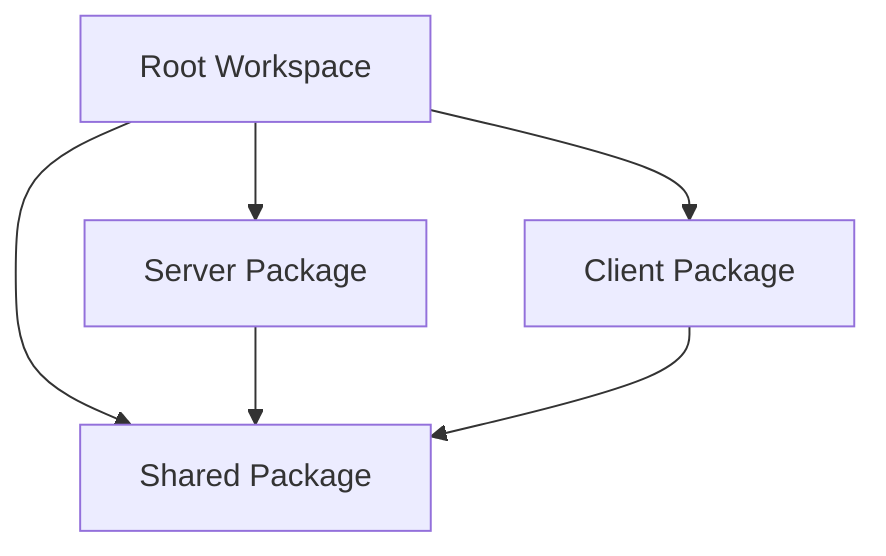

# Development Guide

This guide covers everything you need to know about developing, testing, and contributing to the People Management System.

## Table of Contents

- [Development Environment Setup](#development-environment-setup)
- [Project Structure](#project-structure)
- [Development Workflow](#development-workflow)
- [Code Style Guidelines](#code-style-guidelines)
- [Testing](#testing)
- [Debugging](#debugging)
- [Database Development](#database-development)
- [Contributing Guidelines](#contributing-guidelines)
- [Common Issues and Solutions](#common-issues-and-solutions)

## Development Environment Setup

### Prerequisites

Before starting development, ensure you have the following installed:

- **Python 3.9+**: The project requires Python 3.9 or higher
- **UV**: Fast Python package installer and project manager
- **Git**: Version control system

### Installing UV

```bash
# On macOS/Linux
curl -LsSf https://astral.sh/uv/install.sh | sh

# On Windows (PowerShell)
powershell -c "irm https://astral.sh/uv/install.ps1 | iex"

# Verify installation
uv --version
```

### Environment Setup

1. **Clone the repository**:
```bash
git clone <repository-url>
cd people-management-system
```

2. **Install development dependencies**:
```bash
make dev-install
# This runs: uv sync
```

3. **Set up pre-commit hooks**:
```bash
uv run pre-commit install
```

4. **Initialize the database**:
```bash
make setup-db
# This runs: uv run alembic upgrade head
```

5. **Verify installation**:
```bash
# Run tests
make test

# Start the server
make run-server

# In another terminal, start the client
make run-client
```

### Development Tools Configuration

#### VS Code Setup

Create `.vscode/settings.json`:
```json
{
    "python.defaultInterpreterPath": ".venv/bin/python",
    "python.linting.enabled": true,
    "python.linting.pylintEnabled": false,
    "python.linting.ruffEnabled": true,
    "python.formatting.provider": "black",
    "python.formatting.blackPath": ".venv/bin/black",
    "python.testing.pytestEnabled": true,
    "python.testing.pytestPath": ".venv/bin/pytest",
    "files.exclude": {
        "**/__pycache__": true,
        "**/*.pyc": true,
        "**/*.egg-info": true
    }
}
```

#### PyCharm Setup

1. Set Python interpreter to `.venv/bin/python`
2. Configure code style to use Black formatter
3. Enable Ruff for linting
4. Set up pytest as the test runner

## Project Structure

### Workspace Architecture

The project uses UV workspace to manage multiple packages:

```
people-management-system/
├── client/                 # PySide6 GUI application
├── server/                 # FastAPI REST API
├── shared/                 # Common utilities and models
├── docs/                   # Documentation
├── pyproject.toml         # Workspace configuration
└── uv.lock               # Dependency lock file
```

### Package Dependencies



### Development Packages

Each package has its own development dependencies:

- **Testing**: pytest, pytest-asyncio, pytest-qt, pytest-cov
- **Code Quality**: ruff, black, mypy, pre-commit
- **Type Checking**: mypy with strict configuration

## Development Workflow

### Daily Development

1. **Start development session**:
```bash
# Activate the environment (if needed)
source activate.sh

# Pull latest changes
git pull origin main

# Update dependencies
uv sync
```

2. **Create feature branch**:
```bash
git checkout -b feature/your-feature-name
```

3. **Development cycle**:
```bash
# Make changes to code
# ...

# Format code
make format

# Run linting
make lint

# Run tests
make test

# Commit changes
git add .
git commit -m "Add feature: description"
```

4. **Push changes**:
```bash
git push origin feature/your-feature-name
```

### Continuous Integration Checks

Before pushing, ensure your code passes all checks:

```bash
# Format check
make format-check

# Linting
make lint

# Type checking
uv run mypy server client shared

# Tests with coverage
make test-coverage

# Build check
make build
```

## Code Style Guidelines

### Python Style

We follow PEP 8 with some modifications enforced by our tools:

#### Ruff Configuration

```toml
[tool.ruff]
line-length = 88
target-version = "py39"

[tool.ruff.lint]
select = [
    "E",  # pycodestyle errors
    "W",  # pycodestyle warnings
    "F",  # pyflakes
    "I",  # isort
    "B",  # flake8-bugbear
    "C4", # flake8-comprehensions
    "UP", # pyupgrade
]
```

#### Code Formatting Rules

1. **Line Length**: Maximum 88 characters
2. **Imports**: Organized with isort, grouped by type
3. **Quotes**: Double quotes for strings
4. **Docstrings**: Google-style docstrings for all public functions
5. **Type Hints**: Required for all function signatures

#### Example Code Style

```python
"""
Module docstring describing the purpose.
"""

from typing import Optional, List
from uuid import UUID

from fastapi import APIRouter, Depends, HTTPException
from sqlalchemy.orm import Session

from ..database.models import Person
from ..schemas.person import PersonCreate, PersonResponse


def create_person(
    person_data: PersonCreate,
    db: Session = Depends(get_db)
) -> PersonResponse:
    """
    Create a new person record.
    
    Args:
        person_data: The person data to create
        db: Database session dependency
        
    Returns:
        The created person record
        
    Raises:
        HTTPException: If creation fails
    """
    try:
        person = Person(**person_data.dict())
        db.add(person)
        db.commit()
        db.refresh(person)
        return PersonResponse.from_orm(person)
    except Exception as e:
        db.rollback()
        raise HTTPException(status_code=400, detail=str(e))
```

### Documentation Style

#### Docstring Format

Use Google-style docstrings:

```python
def complex_function(
    param1: str,
    param2: Optional[int] = None,
    param3: bool = False
) -> List[str]:
    """
    Brief description of the function.
    
    Longer description if needed, explaining the purpose,
    algorithm, or important details.
    
    Args:
        param1: Description of param1
        param2: Description of param2, defaults to None
        param3: Description of param3, defaults to False
        
    Returns:
        Description of return value
        
    Raises:
        ValueError: When param1 is empty
        HTTPException: When API call fails
        
    Example:
        >>> result = complex_function("test", 42, True)
        >>> len(result)
        3
    """
```

#### Comment Guidelines

1. **Explain Why, Not What**: Focus on business logic and reasoning
2. **Complex Algorithms**: Document the approach and time complexity
3. **TODO Comments**: Use TODO format: `# TODO: Description of what needs to be done`
4. **FIXME Comments**: Use FIXME for known issues: `# FIXME: Handle edge case when...`

## Testing

### Testing Strategy

We use a comprehensive testing approach:

1. **Unit Tests**: Test individual functions and methods
2. **Integration Tests**: Test component interactions
3. **API Tests**: Test HTTP endpoints
4. **GUI Tests**: Test user interface components
5. **End-to-End Tests**: Test complete user workflows

### Test Structure

```
tests/
├── unit/                   # Unit tests
│   ├── test_models.py     # Database model tests
│   ├── test_services.py   # Service layer tests
│   └── test_utils.py      # Utility function tests
├── integration/           # Integration tests
│   ├── test_api.py       # API integration tests
│   └── test_database.py  # Database integration tests
├── gui/                   # GUI tests
│   ├── test_views.py     # View component tests
│   └── test_widgets.py   # Widget tests
└── e2e/                   # End-to-end tests
    └── test_workflows.py # Complete user workflows
```

### Writing Tests

#### Unit Test Example

```python
import pytest
from unittest.mock import Mock, patch
from uuid import uuid4

from server.database.models import Person
from server.core.exceptions import PersonNotFoundError


class TestPersonModel:
    """Test cases for Person model."""
    
    def test_person_creation_valid_data(self):
        """Test creating a person with valid data."""
        person_data = {
            "first_name": "John",
            "last_name": "Doe",
            "email": "john.doe@example.com"
        }
        person = Person(**person_data)
        
        assert person.first_name == "John"
        assert person.last_name == "Doe"
        assert person.email == "john.doe@example.com"
        assert person.full_name == "John Doe"
    
    def test_person_email_validation(self):
        """Test email validation in person model."""
        with pytest.raises(ValueError, match="Invalid email format"):
            Person(
                first_name="John",
                last_name="Doe",
                email="invalid-email"
            )
    
    @pytest.mark.parametrize("first_name,last_name,expected", [
        ("John", "Doe", "John Doe"),
        ("Jane", "Smith", "Jane Smith"),
        ("", "Test", " Test"),  # Edge case
    ])
    def test_full_name_property(self, first_name, last_name, expected):
        """Test full_name property with various inputs."""
        person = Person(
            first_name=first_name,
            last_name=last_name,
            email="test@example.com"
        )
        assert person.full_name == expected
```

#### API Test Example

```python
import pytest
from fastapi.testclient import TestClient
from sqlalchemy import create_engine
from sqlalchemy.orm import sessionmaker

from server.main import app
from server.database.db import get_db
from server.database.models import Base


@pytest.fixture
def test_db():
    """Create test database session."""
    engine = create_engine("sqlite:///./test.db")
    TestingSessionLocal = sessionmaker(autocommit=False, autoflush=False, bind=engine)
    Base.metadata.create_all(bind=engine)
    
    def override_get_db():
        try:
            db = TestingSessionLocal()
            yield db
        finally:
            db.close()
    
    app.dependency_overrides[get_db] = override_get_db
    yield TestingSessionLocal()
    Base.metadata.drop_all(bind=engine)


@pytest.fixture
def client():
    """Create test client."""
    return TestClient(app)


class TestPeopleAPI:
    """Test cases for People API endpoints."""
    
    def test_create_person_success(self, client, test_db):
        """Test successful person creation."""
        person_data = {
            "first_name": "John",
            "last_name": "Doe",
            "email": "john.doe@example.com",
            "phone": "+1-555-123-4567"
        }
        
        response = client.post("/api/v1/people/", json=person_data)
        
        assert response.status_code == 201
        data = response.json()
        assert data["success"] is True
        assert data["data"]["first_name"] == "John"
        assert data["data"]["email"] == "john.doe@example.com"
    
    def test_create_person_invalid_email(self, client, test_db):
        """Test person creation with invalid email."""
        person_data = {
            "first_name": "John",
            "last_name": "Doe",
            "email": "invalid-email"
        }
        
        response = client.post("/api/v1/people/", json=person_data)
        
        assert response.status_code == 422
        data = response.json()
        assert data["success"] is False
```

### Running Tests

```bash
# Run all tests
make test

# Run specific test file
uv run pytest tests/unit/test_models.py -v

# Run tests with coverage
make test-coverage

# Run tests in parallel
uv run pytest -n auto

# Run specific test method
uv run pytest tests/unit/test_models.py::TestPersonModel::test_person_creation_valid_data -v
```

### Test Configuration

#### pytest Configuration (pyproject.toml)

```toml
[tool.pytest.ini_options]
testpaths = ["tests"]
python_files = ["test_*.py", "*_test.py"]
python_classes = ["Test*"]
python_functions = ["test_*"]
addopts = [
    "--strict-markers",
    "--strict-config",
    "--cov=server",
    "--cov=client",
    "--cov=shared",
    "--cov-report=html",
    "--cov-report=term-missing",
]
```

## Debugging

### Server Debugging

#### Using Python Debugger

```python
import pdb

def problematic_function():
    data = get_some_data()
    pdb.set_trace()  # Debugger will stop here
    result = process_data(data)
    return result
```

#### Using VS Code Debugger

Create `.vscode/launch.json`:

```json
{
    "version": "0.2.0",
    "configurations": [
        {
            "name": "Debug FastAPI Server",
            "type": "python",
            "request": "launch",
            "program": "${workspaceFolder}/server/main.py",
            "console": "integratedTerminal",
            "envFile": "${workspaceFolder}/.env",
            "args": []
        },
        {
            "name": "Debug PySide6 Client",
            "type": "python",
            "request": "launch",
            "program": "${workspaceFolder}/client/main.py",
            "console": "integratedTerminal"
        }
    ]
}
```

#### Logging Configuration

```python
import logging

# Configure logging
logging.basicConfig(
    level=logging.DEBUG,
    format='%(asctime)s - %(name)s - %(levelname)s - %(message)s',
    handlers=[
        logging.StreamHandler(),
        logging.FileHandler('debug.log')
    ]
)

logger = logging.getLogger(__name__)

def debug_function():
    logger.debug("Entering function with params: %s", params)
    logger.info("Processing started")
    logger.warning("Potential issue detected")
    logger.error("Error occurred: %s", error)
```

### Client Debugging

#### Qt Debugging

```python
import sys
from PySide6.QtCore import qDebug, QLoggingCategory

# Enable Qt logging
QLoggingCategory.setFilterRules("qt.qpa.*.debug=true")

# Debug Qt objects
def debug_widget(widget):
    qDebug(f"Widget: {widget.objectName()}")
    qDebug(f"Size: {widget.size()}")
    qDebug(f"Position: {widget.pos()}")
```

### Common Debugging Scenarios

#### Database Issues

```python
# Enable SQLAlchemy logging
import logging
logging.getLogger('sqlalchemy.engine').setLevel(logging.INFO)

# Debug database sessions
def debug_query(session, model):
    query = session.query(model)
    logger.debug("Query: %s", str(query))
    logger.debug("Parameters: %s", query.statement.compile().params)
```

#### API Issues

```python
# Debug HTTP requests
import requests
import logging

# Enable requests logging
logging.getLogger("urllib3.connectionpool").setLevel(logging.DEBUG)

# Custom request logging
def debug_request(response):
    logger.debug("Request URL: %s", response.request.url)
    logger.debug("Request Headers: %s", response.request.headers)
    logger.debug("Response Status: %s", response.status_code)
    logger.debug("Response Body: %s", response.text)
```

## Database Development

### Database Migrations

#### Creating Migrations

```bash
# Create a new migration
make create-migration name="add_user_table"

# This runs: uv run alembic revision --autogenerate -m "add_user_table"
```

#### Migration Best Practices

1. **Descriptive Names**: Use clear, descriptive migration names
2. **Small Changes**: Keep migrations focused on single changes
3. **Test Migrations**: Test both upgrade and downgrade paths
4. **Data Migrations**: Handle data transformation carefully

#### Example Migration

```python
"""Add user authentication table

Revision ID: 001_add_user_table
Revises: 
Create Date: 2024-01-01 12:00:00.000000

"""
from alembic import op
import sqlalchemy as sa
from sqlalchemy.dialects.sqlite import UUID

# revision identifiers
revision = '001_add_user_table'
down_revision = None
branch_labels = None
depends_on = None


def upgrade() -> None:
    """Add user table."""
    op.create_table(
        'users',
        sa.Column('id', UUID(as_uuid=True), primary_key=True),
        sa.Column('username', sa.String(50), nullable=False, unique=True),
        sa.Column('email', sa.String(254), nullable=False, unique=True),
        sa.Column('hashed_password', sa.String(255), nullable=False),
        sa.Column('is_active', sa.Boolean(), default=True),
        sa.Column('created_at', sa.DateTime(), server_default=sa.func.now()),
        sa.Column('updated_at', sa.DateTime(), server_default=sa.func.now(), onupdate=sa.func.now())
    )
    
    # Create indexes
    op.create_index('idx_users_username', 'users', ['username'])
    op.create_index('idx_users_email', 'users', ['email'])


def downgrade() -> None:
    """Remove user table."""
    op.drop_index('idx_users_email', 'users')
    op.drop_index('idx_users_username', 'users')
    op.drop_table('users')
```

### Database Seeding

Create test data for development:

```python
# server/database/seeders.py

from sqlalchemy.orm import Session
from .models import Person, Department, Position, Employment
from datetime import date


def seed_development_data(db: Session):
    """Seed database with development data."""
    
    # Create departments
    engineering = Department(name="Engineering", description="Software development team")
    marketing = Department(name="Marketing", description="Marketing and sales team")
    
    db.add_all([engineering, marketing])
    db.commit()
    
    # Create positions
    senior_dev = Position(title="Senior Developer", department=engineering)
    marketing_manager = Position(title="Marketing Manager", department=marketing)
    
    db.add_all([senior_dev, marketing_manager])
    db.commit()
    
    # Create people
    john = Person(
        first_name="John",
        last_name="Doe",
        email="john.doe@example.com",
        phone="+1-555-123-4567"
    )
    
    jane = Person(
        first_name="Jane",
        last_name="Smith",
        email="jane.smith@example.com",
        phone="+1-555-987-6543"
    )
    
    db.add_all([john, jane])
    db.commit()
    
    # Create employment records
    john_employment = Employment(
        person=john,
        position=senior_dev,
        start_date=date(2023, 1, 15),
        salary=95000,
        is_active=True
    )
    
    jane_employment = Employment(
        person=jane,
        position=marketing_manager,
        start_date=date(2023, 3, 1),
        salary=75000,
        is_active=True
    )
    
    db.add_all([john_employment, jane_employment])
    db.commit()


# Usage
def seed_database():
    """Seed database with development data."""
    from .db import SessionLocal
    
    db = SessionLocal()
    try:
        seed_development_data(db)
        print("Database seeded successfully!")
    except Exception as e:
        print(f"Error seeding database: {e}")
        db.rollback()
    finally:
        db.close()
```

## Contributing Guidelines

### Pull Request Process

1. **Fork the repository** (for external contributors)
2. **Create feature branch**: `git checkout -b feature/amazing-feature`
3. **Make changes** following the code style guidelines
4. **Add tests** for new functionality
5. **Update documentation** if needed
6. **Run all checks**: `make lint && make test`
7. **Commit changes** with descriptive messages
8. **Push to branch**: `git push origin feature/amazing-feature`
9. **Create Pull Request** with detailed description

### Commit Message Format

Use conventional commit format:

```
type(scope): short description

Longer description if needed, explaining what and why.

Fixes #123
```

Types:
- `feat`: New feature
- `fix`: Bug fix
- `docs`: Documentation changes
- `style`: Code style changes (formatting, etc.)
- `refactor`: Code refactoring
- `test`: Adding or updating tests
- `chore`: Maintenance tasks

Examples:
```
feat(api): add user authentication endpoint

Add JWT-based authentication with login and logout endpoints.
Includes password hashing, token generation, and middleware
for protected routes.

Closes #45

fix(client): handle connection timeout gracefully

Improve error handling when API server is unavailable.
Show user-friendly message instead of crashing.

Fixes #67
```

### Code Review Checklist

Before submitting a PR, ensure:

- [ ] Code follows style guidelines
- [ ] All tests pass
- [ ] New functionality has tests
- [ ] Documentation is updated
- [ ] No breaking changes without discussion
- [ ] Performance impact considered
- [ ] Security implications reviewed

## Common Issues and Solutions

### Development Environment Issues

#### UV Installation Problems

```bash
# If UV installation fails, try manual installation
pip install uv

# If PATH issues occur
export PATH="$HOME/.cargo/bin:$PATH"
source ~/.bashrc
```

#### Virtual Environment Issues

```bash
# If virtual environment is corrupted
rm -rf .venv
uv sync

# If dependencies are out of sync
uv sync --refresh
```

### Database Issues

#### Migration Conflicts

```bash
# If migration conflicts occur
uv run alembic heads  # Check multiple heads
uv run alembic merge -m "merge conflicts" head1 head2

# Reset migrations (WARNING: loses data)
uv run alembic downgrade base
uv run alembic upgrade head
```

#### Database Locked Error

```bash
# If SQLite database is locked
# Find and kill processes using the database
lsof | grep people_management.db
kill -9 <process_id>
```

### Testing Issues

#### Qt Test Issues

```bash
# If Qt tests fail with display issues
export QT_QPA_PLATFORM=offscreen
make test
```

#### Coverage Issues

```bash
# If coverage reports are inaccurate
rm -rf .coverage htmlcov/
make test-coverage
```

### Performance Issues

#### Slow API Responses

1. **Check Database Indexes**: Ensure proper indexes on frequently queried fields
2. **Optimize Queries**: Use SQLAlchemy query profiling
3. **Add Caching**: Implement response caching for read-heavy endpoints

#### Memory Leaks

1. **Profile Memory Usage**: Use memory profilers like `memory_profiler`
2. **Check Database Connections**: Ensure proper session cleanup
3. **Monitor Qt Objects**: Check for unreleased Qt objects

### Getting Help

1. **Check Documentation**: Review this guide and architecture docs
2. **Search Issues**: Look for similar problems in GitHub issues
3. **Ask for Help**: Create a detailed issue with:
   - Environment information
   - Steps to reproduce
   - Expected vs actual behavior
   - Relevant logs or error messages

---

This development guide should help you get started with contributing to the People Management System. For additional questions, please refer to the other documentation files or create an issue in the repository.